# Sentinel

Sentinel is a self-hosted SRE investigation and remediation system. It turns
alerts into tenant-scoped incident workflows, gathers evidence through bounded
specialist agents, and places every mutation behind deterministic policy,
approval, idempotency, and audit controls.

The project is designed to demonstrate rigorous AI engineering: reproducible
evaluation, content-addressed evidence, explicit cost bounds, durable agent
state, grounded tool use, and fail-closed release gates. It does not present a
single smoke run as model-quality evidence. Measured results and limitations
are published in [AI_RESULTS.md](docs/ai/AI_RESULTS.md).

## Core properties

- **Bounded investigation:** specialist model turns, tool-result context, total
  recursion, reinvestigation rounds, and wall time are limited independently.
- **Deterministic mutation boundary:** the mutation gateway rechecks tenant,
  namespace, cluster lock, approval receipt, action hash, freshness, and
  idempotency immediately before execution.
- **Process-safe remediation:** successful actions are not replayed after a
  worker restart, and a cleared incident cannot restart remediation.
- **Durable state:** Postgres-backed jobs, graph checkpoints, audit records,
  run manifests, and incident timelines survive process loss.
- **Traceable AI behavior:** Langfuse spans, model-cost ledgers, tool evidence,
  retrieval metrics, and immutable run manifests make a run inspectable.
- **Evaluation-driven release:** prompt, model-routing, and tool-contract
  changes require evidence matching the exact protected source digest.

## Architecture

The FastAPI control plane and LangGraph runtime coordinate Prometheus, Loki,
Kubernetes, GitHub, executor, and Notion runbook MCP servers. The Next.js
console renders persisted incident state; optional Slack war-room threads
provide the conversational on-call surface.



The main investigation path is:

```text
alert -> durable job -> bounded specialists -> reflection -> policy decision
      -> approval when required -> mutation gateway -> verification -> audit
```

See [the architecture index](docs/architecture/README.md) for sequence and data
flow diagrams.

## Quick start

Requirements: Docker with Compose, Python 3.12+, `uv`, and Node 20+ for local
frontend development.

```bash
git clone <repository-url>
cd Sre-automation
bash scripts/dev/start.sh
```

The start script creates local environment files from the shipped examples and
generates internal secrets when they are still empty or placeholders. The stack
boots without an LLM credential; configure the Anthropic key globally or for a
cluster before starting an investigation.

- Console: <http://localhost:3002>
- API documentation: <http://localhost:8080/docs>
- Stop both stacks: `bash scripts/dev/stop.sh`
- Platform logs: `docker compose -f infra/local/docker-compose.yaml logs -f`

Detailed setup and verification commands live in
[docs/getting-started/verification.md](docs/getting-started/verification.md).

## Repository layout

```text
apps/dashboard/                 Next.js operator console
src/sre_agent/                  agent runtime, workflows, policies, API routes
src/backend/                    SQLAlchemy models, CRUD, auth, migrations
services/edge_mcp_servers/      infrastructure and knowledge MCP servers
evals/benchmarks/               datasets, graders, ablations, release evidence
infra/local/                    local Docker Compose runtime
infra/helm/                     Helm chart
infra/k8s/                      plain Kubernetes manifests
infra/terraform/                Terraform wrapper for the Helm deployment
examples/meridian/              reference deployment overlay and runbooks
scripts/ci/                     deterministic CI checks
scripts/dev/                    local lifecycle and smoke scripts
scripts/deploy/                 deployment helpers
scripts/smoke/                  opt-in live integration smoke tests
scripts/tools/                  audits and operational utilities
tests/                          unit and integration contracts
docs/                           architecture, operations, results, and decisions
```

The import namespaces remain `sre_agent`, `backend`, and `benchmarks`; the
package configuration maps them from `src/` and `evals/`.

## Development

Install the Python environment:

```bash
uv sync --frozen --extra dev --extra temporal --extra anthropic
```

Run the local quality gates:

```bash
bash scripts/ci/check_python_quality.sh
bash scripts/ci/check_no_static_secrets.sh
uv run pytest -q
```

For a smaller structural preflight, run
`bash scripts/dev/quickstart_smoke.sh`.

Build the dashboard:

```bash
cd apps/dashboard
npm ci
npm run lint
npx tsc --noEmit
npm run build
```

Validate deployment artifacts when the corresponding tools are installed:

```bash
bash scripts/ci/check_deploy_templates.sh
bash scripts/ci/check_terraform.sh
```

Live benchmark campaigns make paid model calls and require explicit budget
authorization. The release fixture, grader, schema, and statistical tests are
offline and deterministic. Live harness credentials come from environment
variables or the explicit `BENCH_BOOTSTRAP=1` path in
`evals/benchmarks/fixtures.py`; no cluster token is committed.

## Deployment

- Local Compose: [infra/local/README.md](infra/local/README.md)
- Kubernetes manifests: [infra/k8s/README.md](infra/k8s/README.md)
- Helm: [infra/helm/sentinel/README.md](infra/helm/sentinel/README.md)
- Terraform: [infra/terraform/README.md](infra/terraform/README.md)
- Edge MCP services: [services/edge_mcp_servers/README.md](services/edge_mcp_servers/README.md)

Base infrastructure contains no Meridian-specific defaults. The reference
client is isolated under [examples/meridian](examples/meridian).

## Documentation

- [Documentation index](docs/README.md)
- [Architecture](docs/architecture/README.md)
- [AI results and limitations](docs/ai/AI_RESULTS.md)
- [Current project state](docs/ai/PROJECT_STATE.md)
- [Durable engineering decisions](docs/ai/DECISIONS.md)
- [Slack incident threads](docs/operations/slack-incident-threads.md)
- [Evaluation harness](evals/benchmarks/README.md)

## Security posture

Secrets are read from runtime configuration or encrypted tenant records, never
from committed defaults. HTTP, WebSocket, and MCP boundaries authenticate
requests; tenant and cluster scope are derived server-side. See
[SECURITY.md](SECURITY.md) for reporting and local credential hygiene.

## License

MIT. See [LICENSE](LICENSE).
