# Operator console

This Next.js application is the human-facing view of Sentinel's persisted
state. It covers first-run claim and authentication, cluster configuration,
incident and investigation detail, remediation approvals, services, SLOs,
runbooks, jobs, audit records, and organization membership.

The console does not run a separate free-form agent. It reads and updates the
same authenticated API, incident timeline, approval records, and live event
stream used by the durable workflow.

## Development

```bash
cd apps/dashboard
npm ci
npm run dev
```

Quality gates:

```bash
npm run lint
npx tsc --noEmit
npm run build
```

The development server uses port 3000. The local Compose stack publishes the
console on port 3002.

## Structure

- [`app/(auth)/`](app/%28auth%29/): claim, registration, login, and invitation
  acceptance.
- [`app/(dashboard)/`](app/%28dashboard%29/): authenticated operator routes.
- [`components/console/`](components/console/): navigation and shared console
  presentation.
- [`components/console/`](components/console/): shared operator shell and live
  incident notifications.
- [`lib/`](lib/): authenticated API client, live stream, and shared types.
- [`middleware.ts`](middleware.ts): public/protected route boundary.
- [`next.config.ts`](next.config.ts): API rewrites for the local and deployed
  console.



API payload types in the console intentionally mirror contracts in
[`src/backend/schemas.py`](../../src/backend/schemas.py). When changing a
cross-layer contract, update the API schema, UI type, and wiring tests together.
