# Local runtime

`infra/local` contains the Docker Compose control-plane stack and its API and
dashboard Dockerfiles. The stack runs Postgres, Redis, Qdrant, the FastAPI agent
runtime, and the Next.js console. The edge MCP services are an independently
deployable stack under `services/edge_mcp_servers`.

From the repository root, start both stacks with:

```bash
bash scripts/dev/start.sh
```

To run only the control plane:

```bash
bash infra/local/start.sh
```

The startup helper creates the root `.env` when absent, generates internal
secrets that still contain shipped placeholders, validates the provider
configuration, and stamps clean images with the current revision. A dirty
checkout is deliberately marked non-comparable in run manifests.

Ports:

- Console: <http://localhost:3002>
- API and OpenAPI: <http://localhost:8080/docs>
- Redis host port: 6381
- Qdrant host ports: 6333 and 6334

Stop the control plane with `bash infra/local/stop.sh` or both stacks with
`bash scripts/dev/stop.sh`.

The stack boots without a model key. Anthropic is the supported provider;
configure a key globally or for a cluster before starting an investigation.
There is no seeded user or demo cluster.


