# Agent runtime

`sre_agent` contains the FastAPI control plane, durable incident workflows,
LangGraph investigation graph, deterministic policies, tool adapters, and
observability instrumentation.

## Runtime path

1. An alert or operator action creates a durable, tenant-scoped job.
2. Bounded specialist agents collect metrics, logs, Kubernetes, GitHub, and
   runbook evidence.
3. Reflection and planning produce a structured hypothesis and proposed action.
4. Deterministic policy decides whether execution is blocked, autonomous, or
   requires approval.
5. [`mutation_gateway.py`](mutation_gateway.py) revalidates the action directly
   before the tool call.
6. Deterministic verification and persisted audit/timeline records close the
   workflow.

## Important modules

- [`agent_runtime.py`](agent_runtime.py): API application and runtime lifecycle.
- [`graph_builder.py`](graph_builder.py): investigation graph composition.
- [`agent_nodes.py`](agent_nodes.py): specialist ReAct agents.
- [`investigation_limits.py`](investigation_limits.py): structural cost bounds.
- [`incident_remediation_workflow.py`](incident_remediation_workflow.py):
  process-safe remediation orchestration.
- [`act_phase.py`](act_phase.py): action execution and durable receipts.
- [`policy_gate.py`](policy_gate.py) and [`approval_flow.py`](approval_flow.py):
  deterministic authorization.
- [`mutation_gateway.py`](mutation_gateway.py): final write boundary.
- [`runtime_preflight.py`](runtime_preflight.py): API/worker image identity.
- [`run_manifest.py`](run_manifest.py): immutable run provenance.
- [`tracing.py`](tracing.py) and [`model_accounting.py`](model_accounting.py):
  traces and per-call accounting.

Prompts and agent/tool mappings live under [`config/`](config/). API routes are
under [`api/v1/`](api/v1/).

## Invariants

- Successful actions are not replayed after process death.
- Clearing or resolving an incident prevents remediation from restarting.
- Approval cannot override a hard policy block.
- Tenant and namespace scope come from server-owned context.
- Specialist reads and model/tool loops are bounded.
- Missing or inconsistent evaluation evidence blocks release claims.

The focused contracts for these properties live in `tests/`, including
`test_incident_remediation_workflow.py`, `test_mutation_gateway.py`, and
`test_investigation_limits.py`.

Related documentation:

- [Backend package](../backend/README.md)
- [Architecture index](../../docs/architecture/README.md)
- [Evaluation harness](../../evals/benchmarks/README.md)
