# API v1 route groups

- `setup.py`, `members.py`, and `invitations.py`: installation and organization
  administration.
- `clusters.py`: cluster configuration, health, locks, and audit access.
- `alerts.py` and `incidents.py`: alert ingestion and incident lifecycle.
- `mission_control.py` and `remediation_gates.py`: timeline, follow-up,
  verification, and approvals.
- `jobs.py`: durable jobs and immutable run manifests.
- `services.py`, `slos.py`, `runbooks.py`, `analytics.py`, and
  `recommendations.py`: operator data surfaces.
- `tickets.py` and `ws_tickets.py`: integration tickets and authenticated live
  stream access.

Every dashboard route is authenticated and tenant-scoped. Alert ingestion uses
the cluster-token boundary. Mutation routes do not execute tools directly; they
persist intent or approval for the workflow and mutation gateway.

